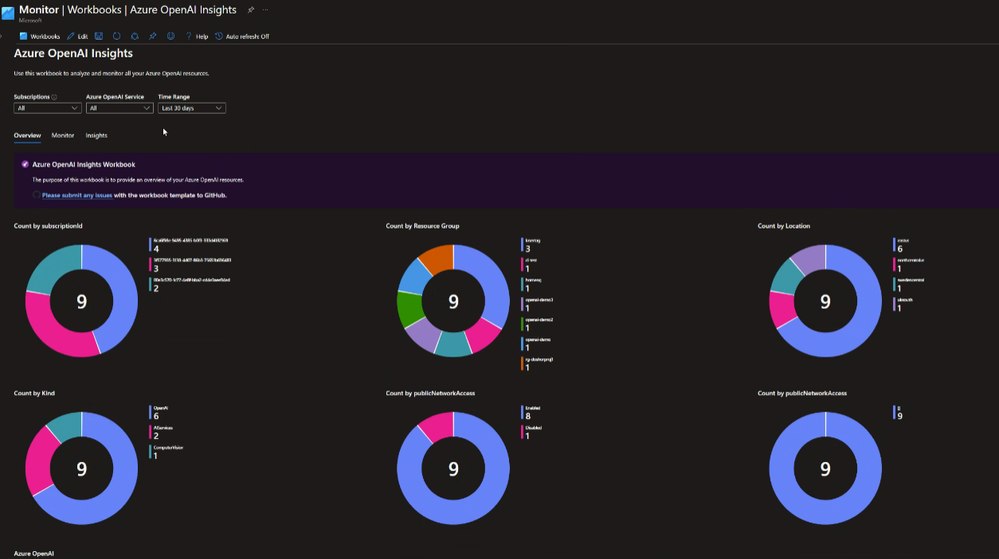

## Deploy monitoring for AI Services

### What is Azure AI Services?

Azure AI services help developers and organizations rapidly create intelligent, cutting-edge, market-ready, and responsible applications with out-of-the-box and prebuilt and customizable APIs and models. Example applications include natural language processing for conversations, search, monitoring, translation, speech, vision, and decision-making.
The following is a comprehensive list of the services within Azure AI Services:

### AzureOpen AI

Azure OpenAI Service provides REST API access to OpenAI's powerful language models including GPT-4o, GPT-4o mini, GPT-4 Turbo with Vision, GPT-4, GPT-3.5-Turbo, and Embeddings model series. These models can be easily adapted to your specific task including but not limited to content generation, summarization, image understanding, semantic search, and natural language to code translation. Users can access the service through REST APIs, Python SDK, or our web-based interface in the Azure OpenAI Studio.

### Responsible AI

At Microsoft, we're committed to the advancement of AI driven by principles that put people first. Generative models such as the ones available in Azure OpenAI have significant potential benefits, but without careful design and thoughtful mitigations, such models have the potential to generate incorrect or even harmful content. Microsoft has made significant investments to help guard against abuse and unintended harm, which includes incorporating Microsoft’s principles for responsible AI use, adopting a Code of Conduct for use of the service, building content filters to support customers, and providing responsible AI information and guidance that customers should consider when using Azure OpenAI.

## Azure Monitoring tools

Before embarking on designing and deploying AzureOpen AI Monitoring, It`s important to familiarize yourself with the necessary Azure services and tools. These include:

* Azure Monitor: This service provides comprehensive solutions for collecting, analyzing, and acting on telemetry from your cloud and on-premises environments. Additionally, this service provides an integrated management environment that includes Metrics, Insights, and Log Analytics workspaces.
* Azure Log Analytics workspace: Part of Azure monitor, it collects and analyzes data generated by resources in your cloud and on-premises environments.

### Tools that allow for visualization

* ***Dashboards*** that let you combine different kinds of data into a single pane in the Azure portal.
* ***Workbooks***, customizable reports that you can create in the Azure portal. Workbooks can include text, metrics, and log queries.
* ***Grafana***, an open platform tool that excels in operational dashboards. You can use Grafana to create dashboards that include data from multiple sources other than Azure Monitor.
* ***Power BI***, a business analytics service that provides interactive visualizations across various data sources. You can configure Power BI to automatically import log data from Azure Monitor to take advantage of these visualizations.

## Azure OpenAI Insights

This workbook offers deep insights into Azure OpenAI resources and usage (Platform Metrics and Logs) and can be powerful tool in analyzing & monitoring your AI initiatives.

Insights usage:
Prior to using insights to monitoring your open AI instance you will need to configure diagnostic settings.

Getting started: Step by step

* Step 1: Download the workbook from [here](https://raw.githubusercontent.com/dolevshor/Azure-OpenAI-Insights/main/Workbook/Azure%20OpenAI%20Insights.workbook).
* Step 2: Import the workbook into your Azure Monitor workspace. Check out our repository for detailed steps.
* Step 3: Optional step; Enable diagnostic settings for your Azure OpenAI resource. This will allow you to view additional dimensions and logs in the workbook. More information on the level of details later in this post.
* Step 4: Explore the workbook.

For full details on this workbook, check out the link [here](https://techcommunity.microsoft.com/t5/fasttrack-for-azure/azure-openai-insights-monitoring-ai-with-confidence/ba-p/4026850)
