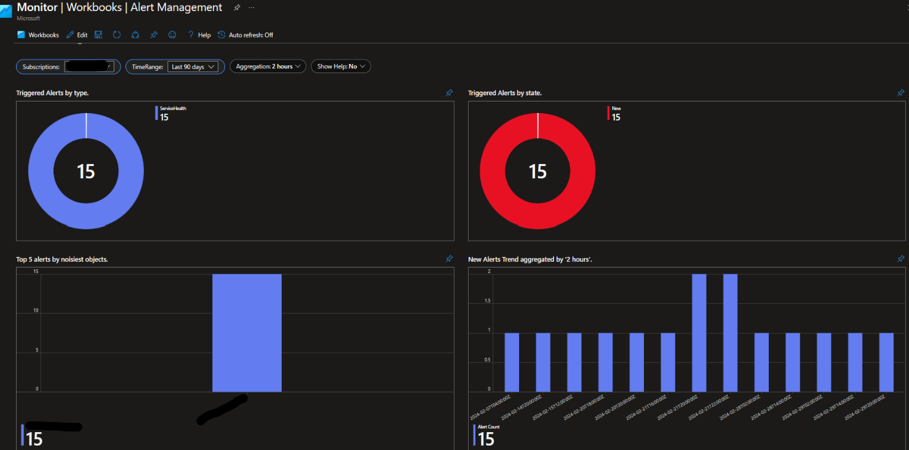

## Overview

[Azure Workbooks](https://learn.microsoft.com/azure/azure-monitor/visualize/workbooks-overview) provide a flexible canvas for data analysis and the creation of rich visual reports. You can use workbooks to tap into multiple data sources from across Azure and combine them into unified interactive experiences.

Listed below are some examples of workbooks that you can use to visualize alerts and key metrics from Azure resources. These workbooks templates can be saved to your workbook gallery in Azure.

You can also find information below on [how to save workbook templates](#import-workbook-templates-quick-start-guide)

## Azure Monitor Community

The Azure Monitor Team utilizes [this](https://github.com/microsoft/AzureMonitorCommunity/tree/master/Azure%20Services) github repo to share workbooks for various azure services. Below are some workbooks to highlight alert management and ExpressRoute/network monitoring.

## [Alert Management Workbook](https://github.com/microsoft/AzureMonitorCommunity/blob/master/Azure%20Services/Azure%20Monitor/Workbooks/Alerts%20Management.workbook)

A summary of alerts by your filtered subscription. This workbook contains visualizations of alerts triggered by type, serverity and top 5 noisiest objects.

## [ExpressRoute Monitoring Workbook](https://github.com/microsoft/AzureMonitorCommunity/blob/master/Azure%20Services/Azure%20Monitor/Workbooks/Azure%20Network%20Monitoring.workbook)

This workbook addresses a common challenge to effectively visualize the health and availability of ExpressRoute components. This is an interactive workbook that provides comprehensive monitoring and troubleshooting for ExpressRoute, including the monitoring of key metrics such as: ExpressRoute Circuit Status, BGP availablity, total throughput, and more.

For full details see:
  [Monitoring ExpressRoute: A Workbook Solution](https://techcommunity.microsoft.com/t5/azure-observability-blog/monitoring-expressroute-a-workbook-solution/ba-p/4038130).

  
  
  

## Import Workbook Templates: quick start guide

Want to see these workbooks live in your Azure environment? Follow these steps to add gallery templates to your saved workbooks.

1. Copy the raw file:
    - In the examples above, the titles of the workbooks are hyperlinks to the raw files. From there you can explore other workbooks in the github repo.
    
2. Open Azure Monitor, and navigate to Workbooks:
    - Once here, click "new".
    
3. Open the advanced editor (</>):
    - Paste the raw code, which was copied in step one, in the gallery template.
    - Once finished, click apply.
    
4. View your workbook and save it to your gallery:
    
